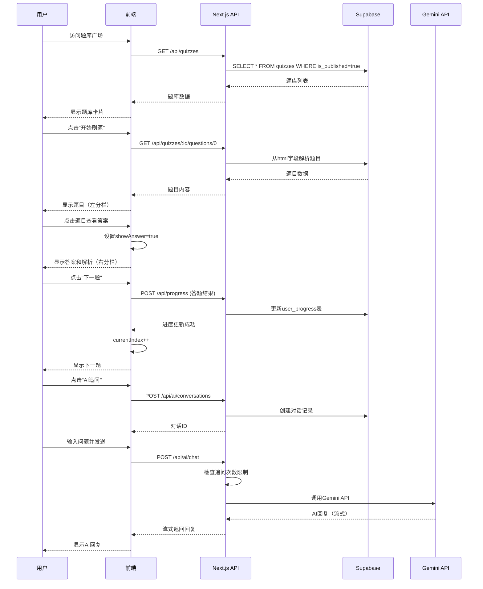

# 开发需求文档 (Dev Spec) - 客户端（用户刷题界面）

## 文档信息
- **版本**: v1.0.0
- **创建日期**: 2026-02-05
- **对应PRD**: Prd-客户端.md
- **开发模式**: Next.js一体化（方案A）

---

## 一、目标与范围

### 1.1 开发目标
构建一个流畅的刷题客户端，支持题库浏览、一屏一题刷题、错题记录、AI追问等核心功能，为备考学员提供零门槛的刷题体验。

### 1.2 功能范围
#### ✅ 在范围内
- 题库广场（浏览、搜索、分类）
- 一屏一题刷题界面（左右分栏）
- 用户登录注册（邮箱+JWT）
- 刷题进度记录
- 错题本功能
- AI追问功能（对话模式）

#### ❌ 不在范围内（V2及以后）
- 用户上传题库
- 题库评价/点赞/评论
- 学习统计和可视化
- 多种刷题模式（随机/章节）
- 移动端优化

---

## 二、用户故事与验收标准

### US-001: 浏览题库广场
**用户故事**: 作为备考学员，我希望能够浏览所有可用的题库，以便选择合适的题库开始刷题。

**验收标准**:
- [ ] 页面加载时显示所有 `is_published=true` 的题库
- [ ] 题库卡片显示：名称、题目数量、难度、更新时间
- [ ] 支持按科目/考试类型分类筛选
- [ ] 支持按题库名称搜索
- [ ] 点击"开始刷题"按钮跳转到刷题界面
- [ ] 无登录状态下可浏览题库广场

### US-002: 一屏一题刷题
**用户故事**: 作为备考学员，我希望在电脑大屏上刷题，左边显示题目，右边显示答案和解析，以便高效记忆。

**验收标准**:
- [ ] 页面采用左右分栏布局（40% : 60%）
- [ ] 左侧显示题目内容（题干+选项）
- [ ] 点击题目后，右侧显示正确答案
- [ ] 答案下方显示详细解析
- [ ] 支持选择题、填空题、大题三种题型
- [ ] 大题如果是证明题，改为选项形式或直接看答案
- [ ] 顶部显示进度（如：15/100）
- [ ] 支持"上一题"、"下一题"导航
- [ ] 当前题目完成后自动跳转到下一题

### US-003: 用户登录注册
**用户故事**: 作为备考学员，我希望能够注册账号并登录，以便记录我的刷题进度和错题。

**验收标准**:
- [ ] 支持邮箱注册（邮箱+密码）
- [ ] 支持邮箱登录
- [ ] 登录成功后生成JWT Token
- [ ] Token存储在localStorage中
- [ ] Token过期后自动跳转登录页
- [ ] 支持退出登录功能

### US-004: 刷题进度记录
**用户故事**: 作为备考学员，我希望系统能够记录我的刷题进度，以便下次继续刷题。

**验收标准**:
- [ ] 每完成一题，自动保存进度到数据库
- [ ] 题库广场显示"继续刷题"按钮（如果有历史进度）
- [ ] 点击"继续刷题"从上次停止的位置开始
- [ ] 进度包含：当前题目索引、已完成数量、正确数、错误数
- [ ] 刷新页面后进度不丢失

### US-005: 错题本功能
**用户故事**: 作为备考学员，我希望系统能够自动记录我的错题，以便后续针对性复习。

**验收标准**:
- [ ] 答题错误时，自动将题目加入错题本
- [ ] 错题本页面显示所有错题列表
- [ ] 显示错题的错误次数和最后错误时间
- [ ] 支持按题库筛选错题
- [ ] 支持重新练习错题
- [ ] 掌握错题后，支持从错题本移除

### US-006: AI追问功能
**用户故事**: 作为备考学员，如果解析不够清楚，我希望能够追问AI，获取更深入的解释。

**验收标准**:
- [ ] 在解析下方显示"AI追问"按钮
- [ ] 点击后弹出模态对话框
- [ ] 对话框显示当前题目和解析
- [ ] 支持用户输入问题并发送
- [ ] AI回复显示在对话框中
- [ ] 支持多轮对话，保持上下文
- [ ] 每个用户每天限制20次追问
- [ ] 超过限制时显示提示信息

---

## 三、功能需求 (Functional Requirements)

### 3.1 题库广场模块

#### FR-001: 题库列表展示
**描述**: 从后端获取所有已发布的题库，以卡片形式展示。

**输入**: 无（页面加载时自动获取）

**输出**: 题库列表数组
```typescript
interface Quiz {
  id: string;
  title: string;
  description: string;
  subject: string;
  exam_type: string;
  difficulty: 'easy' | 'medium' | 'hard';
  question_count: number;
  created_at: string;
  updated_at: string;
}
```

**逻辑**:
1. 调用 `GET /api/quizzes` 获取题库列表
2. 按更新时间倒序排列
3. 渲染题库卡片

**错误处理**:
- 网络错误：显示错误提示，提供重试按钮
- 空数据：显示"暂无题库"空状态

#### FR-002: 题库搜索
**描述**: 根据关键词搜索题库。

**输入**: 搜索关键词（字符串）

**输出**: 过滤后的题库列表

**逻辑**:
1. 监听搜索框输入（防抖500ms）
2. 调用 `GET /api/quizzes?search=关键词`
3. 更新题库列表

#### FR-003: 题库分类筛选
**描述**: 按科目或考试类型筛选题库。

**输入**: 分类参数（如：驾考、高数、英语）

**输出**: 筛选后的题库列表

**逻辑**:
1. 点击分类标签
2. 调用 `GET /api/quizzes?subject=分类`
3. 更新题库列表

### 3.2 刷题模块

#### FR-004: 题目内容解析
**描述**: 从题库HTML中解析出当前题目。

**输入**: 题库ID、题目索引

**输出**: 题目对象
```typescript
interface Question {
  index: number;
  type: 'choice' | 'fill' | 'essay';
  questionText: string;
  options?: string[];  // 选择题选项
  correctAnswer: string;
  explanation: string;
}
```

**逻辑**:
1. 调用 `GET /api/quizzes/:id/questions/:index`
2. 后端从HTML中提取对应题目
3. 返回结构化的题目数据

#### FR-005: 答案显示
**描述**: 点击题目后，显示正确答案和解析。

**输入**: 点击事件

**输出**: 显示答案和解析

**逻辑**:
1. 监听题目区域点击事件
2. 设置 `showAnswer=true`
3. 渲染答案和解析内容

#### FR-006: 题目导航
**描述**: 支持上一题/下一题导航。

**输入**: 导航按钮点击

**输出**: 跳转到指定题目

**逻辑**:
1. 点击"下一题"：`currentIndex++`
2. 点击"上一题"：`currentIndex--`
3. 边界检查：第一题时禁用"上一题"，最后一题时显示"完成"
4. 重置 `showAnswer=false`
5. 加载新题目内容

#### FR-007: 进度更新
**描述**: 每完成一题，更新用户进度。

**输入**: 用户ID、题库ID、题目索引、答题结果（正确/错误）

**输出**: 更新进度数据库

**逻辑**:
1. 用户答题后，调用 `POST /api/progress`
2. 后端更新 `user_progress` 表
3. 如果答错，同时添加到 `wrong_questions` 表

### 3.3 错题本模块

#### FR-008: 错题列表展示
**描述**: 展示用户的所有错题。

**输入**: 用户ID

**输出**: 错题列表
```typescript
interface WrongQuestion {
  id: string;
  quizId: string;
  quizTitle: string;
  questionIndex: number;
  questionText: string;
  wrongAnswer: string;
  correctAnswer: string;
  wrongCount: number;
  lastWrongAt: string;
}
```

**逻辑**:
1. 调用 `GET /api/wrong-questions`
2. 按最后错误时间倒序排列
3. 渲染错题列表

#### FR-009: 错题重新练习
**描述**: 针对错题进行重新练习。

**输入**: 错题ID

**输出**: 跳转到刷题界面，定位到该题

**逻辑**:
1. 点击"重新练习"
2. 跳转到 `/quiz/:quizId?questionIndex=:index`
3. 加载对应题目

#### FR-010: 错题移除
**描述**: 用户掌握错题后，从错题本移除。

**输入**: 错题ID

**输出**: 更新错题状态

**逻辑**:
1. 调用 `DELETE /api/wrong-questions/:id`
2. 后端设置 `is_resolved=true`
3. 前端从列表中移除该错题

### 3.4 AI追问模块

#### FR-011: AI对话初始化
**描述**: 初始化AI对话，传入题目和解析上下文。

**输入**: 题库ID、题目索引、题目内容、解析

**输出**: 创建对话记录

**逻辑**:
1. 点击"AI追问"按钮
2. 调用 `POST /api/ai/conversations`
3. 传入上下文信息
4. 打开模态对话框

#### FR-012: AI消息发送
**描述**: 用户发送问题，AI生成回复。

**输入**: 用户问题文本

**输出**: AI回复内容

**逻辑**:
1. 用户输入问题，点击发送
2. 调用 `POST /api/ai/chat`
3. 后端调用Gemini API生成回复
4. 更新对话历史
5. 显示AI回复（流式输出）

#### FR-013: 追问次数限制
**描述**: 限制用户每天的AI追问次数。

**输入**: 用户ID

**输出**: 剩余追问次数

**逻辑**:
1. 每次追问前，检查今日已用次数
2. 如果达到限制（20次），显示提示
3. 如果未达到，正常处理追问
4. 追问成功后，计数+1

---

## 四、非功能需求 (Non-Functional Requirements)

### 4.1 性能要求
- **首屏加载时间**: < 2秒（题库广场）
- **题目切换速度**: < 500ms
- **AI追问响应**: < 3秒（首字显示）
- **并发支持**: 100+ 用户同时刷题

### 4.2 安全要求
- **密码加密**: 使用bcrypt加密存储
- **JWT安全**: Token有效期7天，存储在localStorage
- **SQL注入防护**: 使用Prisma ORM，参数化查询
- **XSS防护**: React自动转义，用户输入不直接渲染HTML
- **AI追问限流**: 每用户每天20次，防止恶意消耗

### 4.3 可用性要求
- **系统可用性**: 99.5%（每月停机时间 < 3.6小时）
- **错误率**: < 0.1%
- **数据备份**: 每日自动备份Supabase数据库

### 4.4 可观测性要求
- **日志记录**: 所有API调用、错误日志
- **性能监控**: 使用Vercel Analytics
- **错误追踪**: 使用Sentry

---

## 五、数据模型与数据流

### 5.1 数据库Schema（Supabase/PostgreSQL）

#### users表
```sql
CREATE TABLE users (
  id UUID PRIMARY KEY DEFAULT uuid_generate_v4(),
  email VARCHAR(255) UNIQUE NOT NULL,
  password_hash VARCHAR(255) NOT NULL,
  name VARCHAR(100),
  is_active BOOLEAN DEFAULT true,
  created_at TIMESTAMP DEFAULT NOW(),
  updated_at TIMESTAMP DEFAULT NOW()
);

CREATE INDEX idx_users_email ON users(email);
```

#### quizzes表
```sql
CREATE TABLE quizzes (
  id UUID PRIMARY KEY DEFAULT uuid_generate_v4(),
  title VARCHAR(255) NOT NULL,
  description TEXT,
  subject VARCHAR(100),
  exam_type VARCHAR(100),
  difficulty VARCHAR(20) CHECK (difficulty IN ('easy', 'medium', 'hard')),
  question_count INT DEFAULT 0,
  is_published BOOLEAN DEFAULT false,
  html TEXT,
  order_mode INT DEFAULT 0,
  created_at TIMESTAMP DEFAULT NOW(),
  updated_at TIMESTAMP DEFAULT NOW()
);

CREATE INDEX idx_quizzes_published ON quizzes(is_published);
CREATE INDEX idx_quizzes_subject ON quizzes(subject);
```

#### user_progress表
```sql
CREATE TABLE user_progress (
  id UUID PRIMARY KEY DEFAULT uuid_generate_v4(),
  user_id UUID REFERENCES users(id) ON DELETE CASCADE,
  quiz_id UUID REFERENCES quizzes(id) ON DELETE CASCADE,
  current_index INT DEFAULT 0,
  completed_count INT DEFAULT 0,
  correct_count INT DEFAULT 0,
  wrong_count INT DEFAULT 0,
  last_accessed_at TIMESTAMP DEFAULT NOW(),
  created_at TIMESTAMP DEFAULT NOW(),
  updated_at TIMESTAMP DEFAULT NOW(),
  UNIQUE(user_id, quiz_id)
);

CREATE INDEX idx_user_progress_user ON user_progress(user_id);
CREATE INDEX idx_user_progress_quiz ON user_progress(quiz_id);
```

#### wrong_questions表
```sql
CREATE TABLE wrong_questions (
  id UUID PRIMARY KEY DEFAULT uuid_generate_v4(),
  user_id UUID REFERENCES users(id) ON DELETE CASCADE,
  quiz_id UUID REFERENCES quizzes(id) ON DELETE CASCADE,
  question_index INT NOT NULL,
  question_text TEXT NOT NULL,
  wrong_answer TEXT,
  correct_answer TEXT NOT NULL,
  explanation TEXT,
  created_at TIMESTAMP DEFAULT NOW(),
  is_resolved BOOLEAN DEFAULT false
);

CREATE INDEX idx_wrong_questions_user ON wrong_questions(user_id, is_resolved);
CREATE INDEX idx_wrong_questions_quiz ON wrong_questions(quiz_id);
```

#### ai_conversations表
```sql
CREATE TABLE ai_conversations (
  id UUID PRIMARY KEY DEFAULT uuid_generate_v4(),
  user_id UUID REFERENCES users(id) ON DELETE CASCADE,
  quiz_id UUID REFERENCES quizzes(id) ON DELETE CASCADE,
  question_index INT,
  messages JSONB NOT NULL DEFAULT '[]',
  created_at TIMESTAMP DEFAULT NOW()
);

CREATE INDEX idx_ai_conversations_user ON ai_conversations(user_id);
```

### 5.2 数据流图



---

## 六、接口/事件

### 6.1 REST API列表

#### 认证相关

**POST /api/auth/register**
**描述**: 用户注册

**请求体**:
```json
{
  "email": "user@example.com",
  "password": "password123",
  "name": "张三"
}
```

**响应**: 201 Created
```json
{
  "user": {
    "id": "uuid",
    "email": "user@example.com",
    "name": "张三"
  },
  "token": "jwt_token"
}
```

**错误**: 400 Bad Request（邮箱已存在）

---

**POST /api/auth/login**
**描述**: 用户登录

**请求体**:
```json
{
  "email": "user@example.com",
  "password": "password123"
}
```

**响应**: 200 OK
```json
{
  "user": {
    "id": "uuid",
    "email": "user@example.com",
    "name": "张三"
  },
  "token": "jwt_token"
}
```

**错误**: 401 Unauthorized（密码错误）

---

#### 题库相关

**GET /api/quizzes**
**描述**: 获取题库列表

**查询参数**:
- `search`: 搜索关键词（可选）
- `subject`: 科目筛选（可选）

**响应**: 200 OK
```json
{
  "quizzes": [
    {
      "id": "uuid",
      "title": "驾考科目一",
      "description": "机动车驾驶理论考试",
      "subject": "驾考",
      "exam_type": "驾考",
      "difficulty": "medium",
      "question_count": 1500,
      "created_at": "2026-02-01T00:00:00Z",
      "updated_at": "2026-02-05T00:00:00Z"
    }
  ]
}
```

---

**GET /api/quizzes/:id**
**描述**: 获取单个题库详情

**响应**: 200 OK
```json
{
  "quiz": {
    "id": "uuid",
    "title": "驾考科目一",
    "description": "机动车驾驶理论考试",
    "subject": "驾考",
    "question_count": 1500,
    "html": "<div>...</div>"
  }
}
```

---

**GET /api/quizzes/:id/questions/:index**
**描述**: 获取指定索引的题目

**路径参数**:
- `id`: 题库ID
- `index`: 题目索引（从0开始）

**响应**: 200 OK
```json
{
  "question": {
    "index": 0,
    "type": "choice",
    "questionText": "驾驶机动车在高速公路上行驶...",
    "options": [
      "A. 50米以上",
      "B. 100米以上",
      "C. 150米以上",
      "D. 200米以上"
    ],
    "correctAnswer": "B. 100米以上",
    "explanation": "根据《道路交通安全法》..."
  }
}
```

---

#### 进度相关

**GET /api/progress/:quizId**
**描述**: 获取用户在指定题库的进度

**响应**: 200 OK
```json
{
  "progress": {
    "quizId": "uuid",
    "currentIndex": 15,
    "completedCount": 15,
    "correctCount": 12,
    "wrongCount": 3
  }
}
```

---

**POST /api/progress**
**描述**: 更新刷题进度

**请求体**:
```json
{
  "quizId": "uuid",
  "questionIndex": 15,
  "isCorrect": false
}
```

**响应**: 200 OK
```json
{
  "progress": {
    "currentIndex": 16,
    "completedCount": 16,
    "correctCount": 12,
    "wrongCount": 4
  }
}
```

---

#### 错题相关

**GET /api/wrong-questions**
**描述**: 获取用户的错题列表

**查询参数**:
- `quizId`: 题库筛选（可选）

**响应**: 200 OK
```json
{
  "wrongQuestions": [
    {
      "id": "uuid",
      "quizId": "uuid",
      "quizTitle": "驾考科目一",
      "questionIndex": 5,
      "questionText": "驾驶机动车在高速公路上行驶...",
      "wrongAnswer": "A. 50米以上",
      "correctAnswer": "B. 100米以上",
      "explanation": "根据《道路交通安全法》...",
      "wrongCount": 2,
      "lastWrongAt": "2026-02-05T10:30:00Z",
      "isResolved": false
    }
  ]
}
```

---

**DELETE /api/wrong-questions/:id**
**描述**: 从错题本移除题目

**响应**: 204 No Content

---

#### AI追问相关

**POST /api/ai/conversations**
**描述**: 创建AI对话

**请求体**:
```json
{
  "quizId": "uuid",
  "questionIndex": 15,
  "context": {
    "questionText": "驾驶机动车在高速公路上行驶...",
    "explanation": "根据《道路交通安全法》..."
  }
}
```

**响应**: 201 Created
```json
{
  "conversationId": "uuid",
  "messages": [
    {
      "role": "system",
      "content": "你是一个擅长讲解考试题目的AI助手..."
    }
  ]
}
```

---

**POST /api/ai/chat**
**描述**: 发送AI消息

**请求体**:
```json
{
  "conversationId": "uuid",
  "message": "为什么高速上要保持100米以上的距离？"
}
```

**响应**: 200 OK（流式）
```
data: {"content":"这是一个关于安全距离的好问题！"}
data: {"content":"在高速公路上保持100米以上的距离主要有以下几个原因："}
data: {"content":"1. 反应时间：人在高速行驶时..."}
```

**错误**: 429 Too Many Requests（超过每日限制）

---

### 6.2 事件与消息

#### 前端事件
- `quiz:started`: 开始刷题
- `question:answered`: 题目已答题
- `question:navigated`: 题目导航
- `wrongquestion:resolved`: 错题已掌握

#### 无后端消息队列（客户端不涉及）

---

## 七、权限与角色

### 7.1 角色定义
- **游客（未登录）**: 可浏览题库广场，但不能刷题
- **普通用户**: 可刷题、记录进度、使用AI追问
- **管理员**: 可管理题库（在管理面板PRD中定义）

### 7.2 权限矩阵

| 功能 | 游客 | 普通用户 | 管理员 |
|------|------|----------|--------|
| 浏览题库广场 | ✅ | ✅ | ✅ |
| 开始刷题 | ❌ | ✅ | ✅ |
| 记录进度 | ❌ | ✅ | ✅ |
| 错题本 | ❌ | ✅ | ✅ |
| AI追问 | ❌ | ✅ | ✅ |
| 管理题库 | ❌ | ❌ | ✅ |

### 7.3 权限实现
- **前端**: 使用React Context管理用户状态，根据角色渲染UI
- **后端**: 使用中间件验证JWT Token，检查权限
- **数据库**: 使用Supabase RLS（Row Level Security）限制数据访问

---

## 八、交互与状态

### 8.1 关键页面状态

#### 题库广场页面
```typescript
interface QuizSquareState {
  quizzes: Quiz[];
  loading: boolean;
  error: string | null;
  searchQuery: string;
  selectedSubject: string | null;
}
```

#### 刷题页面
```typescript
interface QuizSessionState {
  quiz: Quiz | null;
  currentIndex: number;
  showAnswer: boolean;
  currentQuestion: Question | null;
  progress: Progress | null;
  loading: boolean;
}
```

#### 错题本页面
```typescript
interface WrongQuestionsState {
  wrongQuestions: WrongQuestion[];
  loading: boolean;
  filterQuizId: string | null;
}
```

#### AI追问对话框
```typescript
interface AIChatState {
  conversationId: string | null;
  messages: Message[];
  loading: boolean;
  inputText: string;
  dailyLimit: {
    used: number;
    limit: number;
  };
}
```

### 8.2 空状态设计

#### 题库广场空状态
- **场景**: 没有题库或搜索无结果
- **展示**: 插画 + 文字"暂无题库，敬请期待"

#### 错题本空状态
- **场景**: 用户没有错题
- **展示**: 插画 + 文字"太棒了！你还没有错题"

### 8.3 错误状态处理

#### 网络错误
- **展示**: "网络连接失败，请检查网络后重试"
- **操作**: 提供重试按钮

#### 权限错误
- **展示**: "请先登录"
- **操作**: 跳转到登录页

#### 404错误
- **展示**: "页面不存在"
- **操作**: 返回首页按钮

---

## 九、边界与异常

### 9.1 关键异常与处理策略

#### 异常1: 题库HTML解析失败
**场景**: 题库HTML格式不正确，无法解析出题目

**处理策略**:
1. 后端返回500错误，前端显示"题库加载失败"
2. 记录错误日志，通知管理员
3. 管理员在管理面板修复后重新发布

#### 异常2: 题目索引越界
**场景**: 用户请求的题目索引超出范围

**处理策略**:
1. 后端返回404错误
2. 前端显示"题目不存在"
3. 自动跳转到题库广场

#### 异常3: AI追问失败
**场景**: Gemini API调用失败或超时

**处理策略**:
1. 显示"AI暂时无法回答，请稍后再试"
2. 不扣除追问次数
3. 记录错误日志

#### 异常4: 达到每日追问限制
**场景**: 用户当天已追问20次

**处理策略**:
1. 显示"今日追问次数已用完，明天再来吧"
2. 显示"升级会员可获得更多次数"（未来功能）

#### 异常5: 数据库连接失败
**场景**: Supabase连接超时

**处理策略**:
1. 显示"服务暂时不可用，请稍后再试"
2. 前端使用localStorage缓存已加载的题库
3. 允许离线刷题（已缓存的题库）

---

## 十、影响范围与改动点

### 10.1 前端模块

#### 新增页面
- `/quiz-square` - 题库广场
- `/quiz/:id` - 刷题页面
- `/wrong-questions` - 错题本
- `/login` - 登录页
- `/register` - 注册页

#### 新增组件
- `QuizCard` - 题库卡片
- `QuestionViewer` - 题目查看器（左右分栏）
- `AnswerPanel` - 答案面板
- `AIChatDialog` - AI追问对话框
- `WrongQuestionList` - 错题列表
- `ProgressBar` - 进度条

#### 共享组件
- `Header` - 页头导航（含用户状态）
- `Footer` - 页脚
- `LoadingSpinner` - 加载动画
- `ErrorBoundary` - 错误边界

### 10.2 后端模块

#### API Routes
- `app/api/auth/register/route.ts`
- `app/api/auth/login/route.ts`
- `app/api/quizzes/route.ts`
- `app/api/quizzes/[id]/route.ts`
- `app/api/quizzes/[id]/questions/[index]/route.ts`
- `app/api/progress/route.ts`
- `app/api/progress/[quizId]/route.ts`
- `app/api/wrong-questions/route.ts`
- `app/api/wrong-questions/[id]/route.ts`
- `app/api/ai/conversations/route.ts`
- `app/api/ai/chat/route.ts`

#### 中间件
- `middleware.ts` - JWT验证

#### 工具函数
- `lib/supabase.ts` - Supabase客户端
- `lib/jwt.ts` - JWT工具
- `lib/password.ts` - 密码加密
- `lib/ai.ts` - AI集成
- `lib/parser.ts` - 题库HTML解析

### 10.3 数据库/存储

#### Supabase Tables
- `users`
- `quizzes`
- `user_progress`
- `wrong_questions`
- `ai_conversations`

#### 索引
- 为高频查询字段添加索引（email, is_published, user_id等）

---

## 十一、需求台账 (Requirements Ledger)

| 需求ID | 功能/场景 | 用户故事 | 验收标准 | 数据/接口 | 影响模块 | 状态 |
|--------|----------|----------|----------|-----------|----------|------|
| FR-001 | 题库列表展示 | US-001 | 6项验收标准 | GET /api/quizzes | 题库广场页面 | 待开发 |
| FR-002 | 题库搜索 | US-001 | 3项逻辑 | GET /api/quizzes?search= | 题库广场页面 | 待开发 |
| FR-003 | 题库分类筛选 | US-001 | 3项逻辑 | GET /api/quizzes?subject= | 题库广场页面 | 待开发 |
| FR-004 | 题目内容解析 | US-002 | 5项逻辑 | GET /api/quizzes/:id/questions/:index | 刷题页面 | 待开发 |
| FR-005 | 答案显示 | US-002 | 5项逻辑 | 无 | 刷题页面 | 待开发 |
| FR-006 | 题目导航 | US-002 | 5项逻辑 | 无 | 刷题页面 | 待开发 |
| FR-007 | 进度更新 | US-004 | 5项逻辑 | POST /api/progress | 刷题页面, API | 待开发 |
| FR-008 | 错题列表展示 | US-005 | 5项逻辑 | GET /api/wrong-questions | 错题本页面 | 待开发 |
| FR-009 | 错题重新练习 | US-005 | 5项逻辑 | 无 | 错题本页面 | 待开发 |
| FR-010 | 错题移除 | US-005 | 5项逻辑 | DELETE /api/wrong-questions/:id | 错题本页面, API | 待开发 |
| FR-011 | AI对话初始化 | US-006 | 5项逻辑 | POST /api/ai/conversations | AI追问对话框, API | 待开发 |
| FR-012 | AI消息发送 | US-006 | 5项逻辑 | POST /api/ai/chat | AI追问对话框, API | 待开发 |
| FR-013 | 追问次数限制 | US-006 | 5项逻辑 | 无 | AI追问对话框, API | 待开发 |

---

## 十二、测试与验收

### 12.1 测试类型

#### 单元测试
- **工具**: Jest + React Testing Library
- **覆盖率**: 核心业务逻辑 ≥ 80%
- **测试内容**:
  - 题库解析逻辑
  - 进度计算逻辑
  - JWT生成和验证

#### 集成测试
- **工具**: Supabase CLI + Playwright
- **测试内容**:
  - 完整刷题流程（登录→浏览→刷题→进度）
  - AI追问流程
  - 错题记录和移除

#### E2E测试
- **工具**: Playwright
- **测试场景**:
  - 用户注册→登录→浏览题库→开始刷题→完成10题→查看进度
  - 用户答错题目→查看错题本→重新练习→移除错题
  - 用户点击AI追问→提问→查看回复

### 12.2 验收标准

#### 功能验收
- [ ] 所有用户故事的验收标准全部通过
- [ ] 所有API接口测试通过
- [ ] 核心流程无Bug

#### 性能验收
- [ ] 题库广场首屏加载 < 2秒
- [ ] 题目切换 < 500ms
- [ ] AI追问首字响应 < 3秒

#### 安全验收
- [ ] 密码加密存储
- [ ] JWT验证正常
- [ ] SQL注入测试通过
- [ ] XSS防护测试通过

### 12.3 验收负责人
- **产品负责人**: 用户验收测试（UAT）
- **技术负责人**: 代码审查和自动化测试
- **测试负责人**: 手动测试和Bug追踪

---

## 十三、变更记录

| 版本 | 日期 | 变更摘要 | 影响范围 |
|------|------|----------|----------|
| v1.0.0 | 2026-02-05 | 初始版本，定义客户端MVP功能 | 全部 |

---

## 十四、风险与假设

### 14.1 风险

| 风险 | 影响 | 概率 | 缓解措施 |
|------|------|------|----------|
| Supabase免费限额不够 | 高 | 中 | 监控使用量，及时升级付费计划 |
| AI追问成本过高 | 高 | 中 | 限制每日追问次数（20次/天） |
| 题库HTML解析失败率高 | 高 | 低 | 管理面板人工审核，保证HTML质量 |
| 用户增长导致性能下降 | 中 | 中 | 使用CDN缓存题库内容 |
| Gemini API限流 | 中 | 低 | 使用备用AI API（OpenAI） |

### 14.2 假设

| 假设 | 验证方式 |
|------|----------|
| 题库HTML格式稳定，易于解析 | 解析测试套件 |
| 用户优先使用电脑端刷题 | 用户调研 |
| Gemini API响应时间 < 3秒 | 性能测试 |
| Supabase免费额度足够MVP使用 | 成本估算 |

---

**文档结束**
