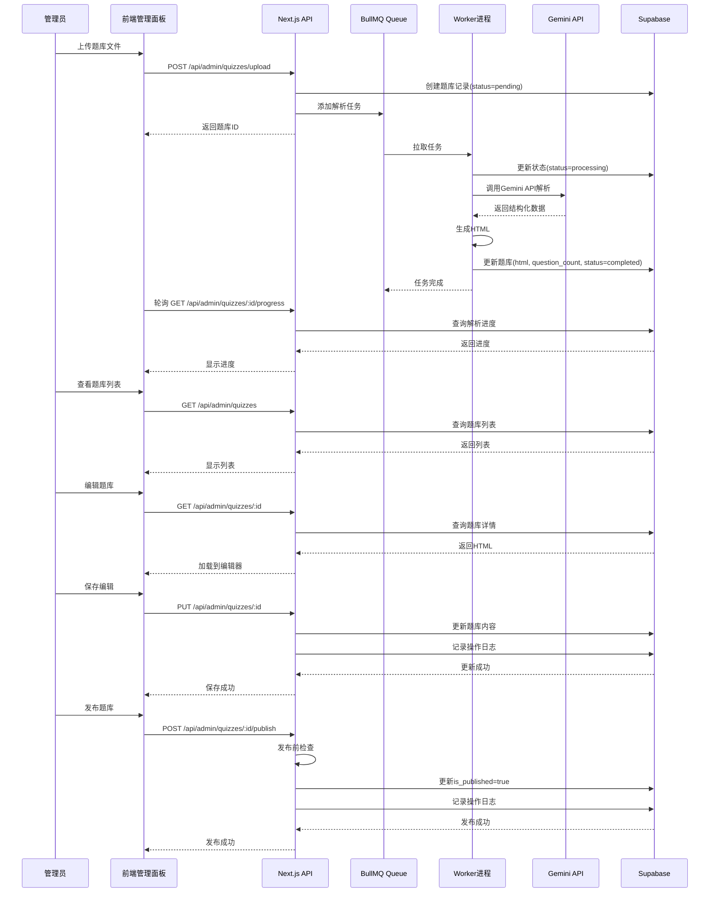
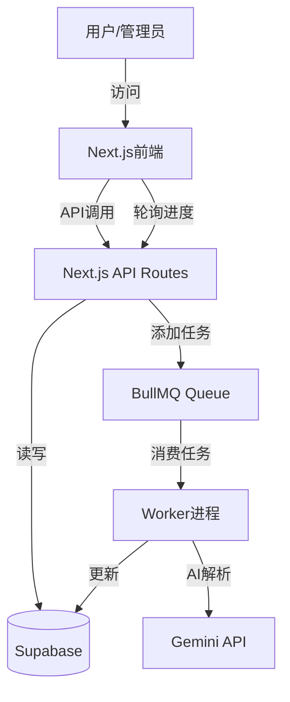

# 开发需求文档 (Dev Spec) - 管理面板（开发者题库管理界面）

## 文档信息
- **版本**: v1.0.0
- **创建日期**: 2026-02-05
- **对应PRD**: Prd-管理面板.md
- **开发模式**: Next.js一体化 + BullMQ + Redis + Worker

---

## 一、目标与范围

### 1.1 开发目标
构建一个高效的题库管理面板，支持文件上传、AI自动解析、人工编辑修复、发布管理等全流程，帮助平台管理员快速处理大量题库（50-100门科目）。

### 1.2 功能范围
#### ✅ 在范围内
- 文件上传（TXT、MD）
- AI自动解析（BullMQ + Worker）
- 题库列表管理（CRUD操作）
- 题库编辑器（HTML编辑、预览）
- 人工兜底机制（解析失败修复）
- AI辅助功能（核实答案、补全解析、格式优化）
- 发布管理（发布、下架）
- 报错反馈（查看、定位、修复）
- 数据统计

#### ❌ 不在范围内（V2及以后）
- 批量上传（多文件同时上传）
- OCR集成（图片/PDF识别）
- 版本控制（编辑历史、回滚）
- 协作编辑（多人同时编辑）
- 题库导入导出（第三方平台）

---

## 二、用户故事与验收标准

### US-001: 上传题库文件
**用户故事**: 作为管理员，我希望能够上传题库文件（TXT/MD），以便系统自动解析成结构化题库。

**验收标准**:
- [ ] 支持拖拽上传或点击选择文件
- [ ] 文件格式限制：.txt、.md
- [ ] 文件大小限制：≤ 10MB
- [ ] 显示上传进度条
- [ ] 上传成功后，显示文件预览
- [ ] 自动创建草稿题库记录（status=pending）
- [ ] 自动触发AI解析任务

### US-002: AI自动解析
**用户故事**: 作为管理员，我希望上传的文件能够自动解析，减少我的工作量。

**验收标准**:
- [ ] 上传后自动将解析任务加入BullMQ队列
- [ ] Worker实时更新解析进度（parse_progress字段）
- [ ] 解析完成后生成HTML内容
- [ ] 解析失败时，记录错误信息到error_msg字段
- [ ] 解析状态流转：pending → processing → completed/failed
- [ ] 支持实时查看解析进度（WebSocket或轮询）
- [ ] 解析成功后，题目数量自动更新（question_count字段）

### US-003: 查看题库列表
**用户故事**: 作为管理员，我希望能够查看所有题库，以便了解题库的整体情况。

**验收标准**:
- [ ] 显示所有题库（草稿+已发布+失败）
- [ ] 支持状态筛选（全部/已发布/草稿/失败）
- [ ] 支持按名称搜索
- [ ] 显示题库信息：名称、状态、题目数量、更新时间
- [ ] 提供操作按钮：编辑、发布、下架、删除
- [ ] 支持分页（每页20条）

### US-004: 编辑题库
**用户故事**: 作为管理员，我希望能够编辑题库内容，以便修复AI解析的错误或优化内容。

**验收标准**:
- [ ] 提供HTML编辑器（Monaco Editor）
- [ ] 支持预览模式（客户端视角）
- [ ] 支持纯文本模式（直接编辑原始内容）
- [ ] 支持题目级导航（快速定位到指定题目）
- [ ] 编辑后自动保存到草稿
- [ ] 保存时更新updated_at字段
- [ ] 已发布的题库编辑时，提示"已有X用户刷过此题库"

### US-005: 修复解析失败
**用户故事**: 作为管理员，当AI解析失败时，我希望能够手动修复，以便成功生成题库。

**验收标准**:
- [ ] 解析失败的题库显示"修复"按钮
- [ ] 点击"修复"进入编辑模式
- [ ] 显示错误信息（error_msg字段）
- [ ] 提供纯文本编辑器（适合格式修复）
- [ ] 修复后，支持重新触发解析
- [ ] 重新解析成功后，状态更新为completed

### US-006: AI辅助核实答案
**用户故事**: 作为管理员，我希望AI能够核实答案的正确性，以便保证题库质量。

**验收标准**:
- [ ] 选中某个题目后，显示"AI核实"按钮
- [ ] 点击后，调用AI API核实答案
- [ ] AI返回结果：正确/可能有误/错误
- [ ] 如果AI认为答案有误，显示AI的建议答案
- [ ] 管理员可选择采纳AI建议或保持原答案

### US-007: AI补全解析
**用户故事**: 作为管理员，如果某个题目的解析缺失或过于简单，我希望AI能够自动补全解析。

**验收标准**:
- [ ] 选中某个题目后，显示"AI补全解析"按钮
- [ ] 点击后，调用AI API生成解析
- [ ] AI生成的解析显示在编辑器中
- [ ] 管理员可手动编辑AI生成的解析
- [ ] 保存后更新题库内容

### US-008: 发布题库
**用户故事**: 作为管理员，我希望审核无误后，能够一键发布题库到客户端。

**验收标准**:
- [ ] 草稿状态的题库显示"发布"按钮
- [ ] 点击"发布"前，进行预检查：
  - 题目数量 > 0
  - 每题都有答案
  - HTML格式正确
- [ ] 检查通过后，发布成功（is_published=true）
- [ ] 发布后，客户端题库广场可见
- [ ] 发布后，操作按钮变为"下架"

### US-009: 处理用户报错
**用户故事**: 作为管理员，我希望能够查看和处理用户的报错反馈，以便提升题库质量。

**验收标准**:
- [ ] 显示所有用户报错列表
- [ ] 显示报错详情：题库名称、题目索引、错误类型、描述
- [ ] 点击"修复"按钮，自动跳转到对应题目的编辑位置
- [ ] 修复后，标记报错为"已处理"（status=resolved）
- [ ] 支持忽略报错（status=ignored）
- [ ] 记录管理员备注（admin_note字段）

### US-010: 查看数据统计
**用户故事**: 作为管理员，我希望能够查看题库统计数据，以便了解整体情况。

**验收标准**:
- [ ] 显示题库总数、已发布数、草稿数、失败数
- [ ] 显示解析成功率（成功数/总数）
- [ ] 显示待处理报错数量
- [ ] 显示热门题库Top10（刷题次数）
- [ ] 数据每小时自动更新

---

## 三、功能需求 (Functional Requirements)

### 3.1 文件上传模块

#### FR-001: 文件上传处理
**描述**: 处理用户上传的题库文件。

**输入**: 文件对象（.txt或.md）

**输出**: 创建草稿题库，返回题库ID

**逻辑**:
1. 验证文件格式（.txt、.md）
2. 验证文件大小（≤ 10MB）
3. 读取文件内容
4. 创建题库记录（status=pending）
5. 保存文件到存储（Supabase Storage或本地）
6. 触发AI解析任务（加入BullMQ队列）
7. 返回题库ID

**错误处理**:
- 格式不支持：返回400错误
- 文件过大：返回413错误
- 读取失败：返回500错误

#### FR-002: 上传进度显示
**描述**: 实时显示文件上传进度。

**输入**: 无

**输出**: 上传进度百分比

**逻辑**:
1. 使用XMLHttpRequest.upload.onprogress监听上传进度
2. 实时更新UI进度条
3. 上传完成后，跳转到题库详情页

### 3.2 AI解析模块

#### FR-003: 解析任务队列
**描述**: 使用BullMQ管理解析任务队列。

**输入**: 题库ID、文件路径

**输出**: 创建队列任务

**逻辑**:
1. 创建BullMQ队列（quiz-parse-queue）
2. 添加任务到队列
3. 设置任务选项：
   - attempts: 2（失败重试1次）
   - timeout: 300000（5分钟超时）
4. Worker监听队列，处理任务

#### FR-004: AI解析逻辑（Worker）
**描述**: Worker执行AI解析任务。

**输入**: 题库ID、文件内容

**输出**: 生成的HTML、题目数量

**逻辑**:
1. 从文件中提取题目文本
2. 调用Gemini API解析（使用Prompt模板）
3. AI返回结构化题目数据（JSON格式）
4. 生成HTML（使用预定义模板）
5. 更新数据库：
   - html字段：生成的HTML
   - question_count字段：题目数量
   - status字段：completed
   - parse_progress字段：100
6. 如果失败，记录错误信息，status=failed

**AI Prompt模板**:
```markdown
你是一个专业的题库解析助手。请将以下文本解析成结构化的题库HTML格式。

要求：
1. 识别题目类型（选择题/填空题/大题）
2. 提取题干、选项、正确答案、解析
3. 生成符合规范的HTML格式
4. 如果无法识别，返回错误信息

输入文本：
{{RAW_TEXT}}

请按以下JSON格式输出：
{
  "success": true/false,
  "questions": [
    {
      "type": "choice/fill/essay",
      "questionText": "...",
      "options": ["A. ...", "B. ..."],
      "correctAnswer": "...",
      "explanation": "..."
    }
  ],
  "error": "错误信息（如果失败）"
}
```

#### FR-005: 解析进度更新
**描述**: Worker实时更新解析进度。

**输入**: 题库ID、当前解析题目数、总题目数

**输出**: 更新数据库进度字段

**逻辑**:
1. 每解析完10题，更新一次数据库
2. 更新字段：
   - parse_progress: (当前题数/总数)*100
   - status: processing
3. 前端通过轮询或WebSocket获取最新进度

### 3.3 题库列表模块

#### FR-006: 题库列表查询
**描述**: 查询所有题库，支持筛选和搜索。

**输入**: 筛选参数（status、subject、search）

**输出**: 题库列表

**逻辑**:
1. 构建查询条件：
   - 如果指定status，添加WHERE条件
   - 如果指定search，添加LIKE模糊查询
2. 按updated_at倒序排列
3. 分页查询（每页20条）
4. 返回题库列表

#### FR-007: 题库操作
**描述**: 对题库进行编辑、发布、下架、删除操作。

**输入**: 题库ID、操作类型

**输出**: 操作结果

**逻辑**:
- **编辑**: 更新题库字段（title、description、html等）
- **发布**: 更新is_published=true，记录发布时间
- **下架**: 更新is_published=false
- **删除**: 软删除（标记deleted_at）或硬删除

### 3.4 题库编辑器模块

#### FR-008: HTML编辑器
**描述**: 提供Monaco Editor编辑HTML内容。

**输入**: 题库ID

**输出**: HTML内容

**逻辑**:
1. 从数据库读取题库HTML
2. 加载到Monaco Editor
3. 支持语法高亮、自动补全
4. 编辑后保存到数据库

#### FR-009: 题目级导航
**描述**: 快速定位到指定题目。

**输入**: 题目索引

**输出**: 滚动到对应题目位置

**逻辑**:
1. 解析HTML，提取所有题目位置
2. 生成题目索引列表（侧边栏）
3. 点击索引，滚动到对应位置

#### FR-010: 批量替换
**描述**: 批量替换HTML中的文本。

**输入**: 查找文本、替换文本

**输出**: 替换后的HTML

**逻辑**:
1. 用户输入查找和替换文本
2. 全局替换HTML内容
3. 显示替换结果（替换了X处）
4. 保存到数据库

### 3.5 AI辅助模块

#### FR-011: AI核实答案
**描述**: 调用AI核实答案正确性。

**输入**: 题目内容、答案

**输出**: AI核实结果

**逻辑**:
1. 提取题目文本和答案
2. 调用Gemini API，发送核实请求
3. AI返回：
   - correct: 答案正确
   - uncertain: 答案可能有误
   - wrong: 答案错误，并给出建议答案
4. 显示AI结果
5. 如果AI认为有误，提供"采纳建议"按钮

**Prompt**:
```markdown
请核实以下题目的答案是否正确：

题目：{{QUESTION_TEXT}}
当前答案：{{ANSWER}}

请判断：
1. 如果答案正确，返回 {"result": "correct"}
2. 如果不确定，返回 {"result": "uncertain", "reason": "原因"}
3. 如果答案错误，返回 {"result": "wrong", "correctAnswer": "正确答案", "reason": "原因"}
```

#### FR-012: AI补全解析
**描述**: 调用AI自动生成解析。

**输入**: 题目内容、答案

**输出**: AI生成的解析

**逻辑**:
1. 提取题目文本和答案
2. 调用Gemini API，请求生成解析
3. AI返回解析文本
4. 将解析插入到HTML中
5. 保存到数据库

**Prompt**:
```markdown
请为以下题目生成详细的解析：

题目：{{QUESTION_TEXT}}
答案：{{ANSWER}}

要求：
1. 解析要详细，逐步说明
2. 如果有公式或定理，列出引用
3. 语言通俗易懂，适合学生理解

请返回解析文本。
```

### 3.6 报错反馈模块

#### FR-013: 报错列表查询
**描述**: 查询所有用户报错。

**输入**: 筛选参数（status、error_type）

**输出**: 报错列表

**逻辑**:
1. 构建查询条件
2. 按created_at倒序排列
3. 分页查询
4. 返回报错列表

#### FR-014: 报错处理
**描述**: 处理用户报错（修复或忽略）。

**输入**: 报错ID、处理类型、管理员备注

**输出**: 处理结果

**逻辑**:
- **修复**:
  1. 更新报错状态为resolved
  2. 记录管理员备注
  3. 记录解决时间
  4. （可选）自动通知用户
- **忽略**:
  1. 更新报错状态为ignored
  2. 记录管理员备注

---

## 四、非功能需求 (Non-Functional Requirements)

### 4.1 性能要求
- **文件上传速度**: ≥ 1MB/s
- **解析速度**: 1000题题库 < 10分钟
- **编辑器加载**: < 2秒
- **列表查询**: < 500ms

### 4.2 安全要求
- **管理员认证**: JWT Token验证
- **权限控制**: 只有管理员能访问管理面板
- **文件安全**: 上传文件进行病毒扫描（未来）
- **操作审计**: 记录所有管理操作到audit_log

### 4.3 可用性要求
- **系统可用性**: 99.5%（每月停机时间 < 3.6小时）
- **Worker稳定性**: Worker崩溃后自动重启
- **任务重试**: 解析失败后自动重试1次

### 4.4 可观测性要求
- **日志记录**: 所有API调用、Worker任务、错误日志
- **性能监控**: 解析耗时、API响应时间
- **错误追踪**: 使用Sentry记录错误
- **队列监控**: BullMQ Board监控队列状态

---

## 五、数据模型与数据流

### 5.1 数据库Schema（Supabase/PostgreSQL）

#### quizzes表（与客户端共享，扩展字段）
```sql
CREATE TABLE quizzes (
  id UUID PRIMARY KEY DEFAULT uuid_generate_v4(),
  title VARCHAR(255) NOT NULL,
  description TEXT,
  subject VARCHAR(100),
  exam_type VARCHAR(100),
  difficulty VARCHAR(20) CHECK (difficulty IN ('easy', 'medium', 'hard')),
  question_count INT DEFAULT 0,
  is_published BOOLEAN DEFAULT false,
  html TEXT,
  file_path VARCHAR(255),
  file_type VARCHAR(20) CHECK (file_type IN ('txt', 'md')),
  status VARCHAR(20) DEFAULT 'pending' CHECK (status IN ('pending', 'processing', 'completed', 'failed')),
  error_msg TEXT,
  parse_progress INT DEFAULT 0 CHECK (parse_progress >= 0 AND parse_progress <= 100),
  order_mode INT DEFAULT 0,
  deleted_at TIMESTAMP,
  created_at TIMESTAMP DEFAULT NOW(),
  updated_at TIMESTAMP DEFAULT NOW()
);

CREATE INDEX idx_quizzes_status ON quizzes(status, deleted_at);
CREATE INDEX idx_quizzes_published ON quizzes(is_published, deleted_at);
```

#### parse_jobs表
```sql
CREATE TABLE parse_jobs (
  id UUID PRIMARY KEY DEFAULT uuid_generate_v4(),
  quiz_id UUID REFERENCES quizzes(id) ON DELETE CASCADE,
  status VARCHAR(20) DEFAULT 'pending' CHECK (status IN ('pending', 'processing', 'completed', 'failed')),
  progress INT DEFAULT 0,
  error TEXT,
  started_at TIMESTAMP,
  completed_at TIMESTAMP,
  created_at TIMESTAMP DEFAULT NOW()
);

CREATE INDEX idx_parse_jobs_quiz ON parse_jobs(quiz_id);
CREATE INDEX idx_parse_jobs_status ON parse_jobs(status);
```

#### error_reports表
```sql
CREATE TABLE error_reports (
  id UUID PRIMARY KEY DEFAULT uuid_generate_v4(),
  user_id UUID REFERENCES users(id) ON DELETE CASCADE,
  quiz_id UUID REFERENCES quizzes(id) ON DELETE CASCADE,
  question_index INT NOT NULL,
  error_type VARCHAR(50) CHECK (error_type IN ('wrong_answer', 'unclear_explanation', 'missing_question', 'format_issue')),
  description TEXT,
  status VARCHAR(20) DEFAULT 'pending' CHECK (status IN ('pending', 'resolved', 'ignored')),
  admin_note TEXT,
  created_at TIMESTAMP DEFAULT NOW(),
  resolved_at TIMESTAMP
);

CREATE INDEX idx_error_reports_quiz ON error_reports(quiz_id, status);
CREATE INDEX idx_error_reports_user ON error_reports(user_id);
```

#### admin_audit_log表
```sql
CREATE TABLE admin_audit_log (
  id UUID PRIMARY KEY DEFAULT uuid_generate_v4(),
  admin_id UUID REFERENCES users(id) ON DELETE CASCADE,
  action VARCHAR(50) CHECK (action IN ('create_quiz', 'edit_quiz', 'publish_quiz', 'unpublish_quiz', 'delete_quiz', 'fix_error', 'ignore_error')),
  target_type VARCHAR(50) CHECK (target_type IN ('quiz', 'error_report')),
  target_id UUID,
  details JSONB,
  created_at TIMESTAMP DEFAULT NOW()
);

CREATE INDEX idx_admin_audit_log_admin ON admin_audit_log(admin_id);
CREATE INDEX idx_admin_audit_log_target ON admin_audit_log(target_type, target_id);
```

### 5.2 数据流图



---

## 六、接口/事件

### 6.1 REST API列表

#### 管理员认证
**POST /api/admin/auth/login**
**描述**: 管理员登录（复用客户端登录接口）

**请求体**:
```json
{
  "email": "admin@example.com",
  "password": "admin123"
}
```

**响应**: 200 OK
```json
{
  "user": {
    "id": "uuid",
    "email": "admin@example.com",
    "role": "admin"
  },
  "token": "jwt_token"
}
```

---

#### 题库管理

**POST /api/admin/quizzes/upload**
**描述**: 上传题库文件并触发解析

**请求体**: multipart/form-data
```
file: quiz.txt
title: 驾考科目一
subject: 驾考
exam_type: 驾考
difficulty: medium
```

**响应**: 201 Created
```json
{
  "quizId": "uuid",
  "status": "pending",
  "message": "题库上传成功，正在解析..."
}
```

---

**GET /api/admin/quizzes**
**描述**: 获取题库列表

**查询参数**:
- `status`: 状态筛选（可选）
- `search`: 搜索关键词（可选）
- `page`: 页码（默认1）
- `limit`: 每页数量（默认20）

**响应**: 200 OK
```json
{
  "quizzes": [
    {
      "id": "uuid",
      "title": "驾考科目一",
      "subject": "驾考",
      "questionCount": 1500,
      "status": "completed",
      "isPublished": true,
      "parseProgress": 100,
      "createdAt": "2026-02-01T00:00:00Z",
      "updatedAt": "2026-02-05T00:00:00Z"
    }
  ],
  "total": 50,
  "page": 1,
  "limit": 20
}
```

---

**GET /api/admin/quizzes/:id**
**描述**: 获取题库详情

**响应**: 200 OK
```json
{
  "quiz": {
    "id": "uuid",
    "title": "驾考科目一",
    "description": "机动车驾驶理论考试",
    "subject": "驾考",
    "examType": "驾考",
    "difficulty": "medium",
    "questionCount": 1500,
    "isPublished": true,
    "html": "<div>...</div>",
    "status": "completed",
    "parseProgress": 100,
    "errorMsg": null,
    "filePath": "/uploads/quiz.txt",
    "fileType": "txt",
    "createdAt": "2026-02-01T00:00:00Z",
    "updatedAt": "2026-02-05T00:00:00Z"
  }
}
```

---

**GET /api/admin/quizzes/:id/progress**
**描述**: 获取解析进度

**响应**: 200 OK
```json
{
  "quizId": "uuid",
  "status": "processing",
  "progress": 45,
  "message": "正在解析第 450/1000 题..."
}
```

---

**PUT /api/admin/quizzes/:id**
**描述**: 更新题库内容

**请求体**:
```json
{
  "title": "驾考科目一（更新版）",
  "description": "机动车驾驶理论考试",
  "html": "<div>...</div>"
}
```

**响应**: 200 OK
```json
{
  "quiz": {
    "id": "uuid",
    "title": "驾考科目一（更新版）",
    "updatedAt": "2026-02-05T12:00:00Z"
  }
}
```

---

**POST /api/admin/quizzes/:id/publish**
**描述**: 发布题库

**请求体**:
```json
{}
```

**响应**: 200 OK
```json
{
  "quizId": "uuid",
  "isPublished": true,
  "publishedAt": "2026-02-05T12:00:00Z"
}
```

**错误**: 400 Bad Request
```json
{
  "error": "题库不能发布",
  "reasons": [
    "题目数量为0",
    "第5题缺少答案"
  ]
}
```

---

**POST /api/admin/quizzes/:id/unpublish**
**描述**: 下架题库

**响应**: 200 OK
```json
{
  "quizId": "uuid",
  "isPublished": false,
  "unpublishedAt": "2026-02-05T12:00:00Z"
}
```

---

**DELETE /api/admin/quizzes/:id**
**描述**: 删除题库（软删除）

**响应**: 204 No Content

---

#### AI辅助功能

**POST /api/admin/quizzes/:id/ai/verify**
**描述**: AI核实答案

**请求体**:
```json
{
  "questionIndex": 5
}
```

**响应**: 200 OK
```json
{
  "result": "correct",
  "reason": null
}
```

或
```json
{
  "result": "wrong",
  "reason": "根据《道路交通安全法》，正确答案应该是100米以上，而非50米",
  "suggestedAnswer": "B. 100米以上"
}
```

---

**POST /api/admin/quizzes/:id/ai/generate-explanation**
**描述**: AI生成解析

**请求体**:
```json
{
  "questionIndex": 5
}
```

**响应**: 200 OK
```json
{
  "explanation": "根据《道路交通安全法》第67条规定，在高速公路上行驶..."
}
```

---

#### 报错反馈

**GET /api/admin/error-reports**
**描述**: 获取报错列表

**查询参数**:
- `status`: 状态筛选（可选）
- `errorType`: 错误类型筛选（可选）
- `page`: 页码
- `limit`: 每页数量

**响应**: 200 OK
```json
{
  "errorReports": [
    {
      "id": "uuid",
      "quizId": "uuid",
      "quizTitle": "驾考科目一",
      "questionIndex": 5,
      "errorType": "wrong_answer",
      "description": "答案应该是C，不是B",
      "status": "pending",
      "createdAt": "2026-02-05T10:00:00Z"
    }
  ],
  "total": 8,
  "page": 1,
  "limit": 20
}
```

---

**POST /api/admin/error-reports/:id/resolve**
**描述**: 处理报错

**请求体**:
```json
{
  "adminNote": "已修正答案为C"
}
```

**响应**: 200 OK
```json
{
  "id": "uuid",
  "status": "resolved",
  "resolvedAt": "2026-02-05T12:00:00Z"
}
```

---

**POST /api/admin/error-reports/:id/ignore**
**描述**: 忽略报错

**请求体**:
```json
{
  "adminNote": "原答案正确，用户误解"
}
```

**响应**: 200 OK
```json
{
  "id": "uuid",
  "status": "ignored"
}
```

---

#### 统计数据

**GET /api/admin/stats**
**描述**: 获取统计数据

**响应**: 200 OK
```json
{
  "totalQuizzes": 50,
  "publishedQuizzes": 35,
  "draftQuizzes": 12,
  "failedQuizzes": 3,
  "parseSuccessRate": 0.94,
  "pendingErrorReports": 8,
  "popularQuizzes": [
    {
      "id": "uuid",
      "title": "驾考科目一",
      "viewCount": 15000
    }
  ]
}
```

---

### 6.2 BullMQ队列事件

#### quiz-parse-queue
**事件类型**: 任务队列

**任务数据**:
```typescript
{
  quizId: string;
  filePath: string;
  fileType: 'txt' | 'md';
}
```

**任务状态**:
- `pending`: 等待处理
- `active`: 正在处理
- `completed`: 处理成功
- `failed`: 处理失败

**重试策略**:
- `attempts`: 2
- `backoff`: { type: 'exponential', delay: 5000 }

---

## 七、权限与角色

### 7.1 角色定义
- **超级管理员**: 拥有所有权限
- **内容管理员**: 可管理题库，但不能删除
- **审核员**: 只能查看和处理报错，不能发布题库

### 7.2 权限矩阵

| 功能 | 超级管理员 | 内容管理员 | 审核员 |
|------|-----------|-----------|--------|
| 上传题库 | ✅ | ✅ | ❌ |
| 编辑题库 | ✅ | ✅ | ❌ |
| 发布题库 | ✅ | ✅ | ❌ |
| 下架题库 | ✅ | ✅ | ❌ |
| 删除题库 | ✅ | ❌ | ❌ |
| AI辅助功能 | ✅ | ✅ | ❌ |
| 查看报错 | ✅ | ✅ | ✅ |
| 处理报错 | ✅ | ✅ | ✅ |
| 查看统计 | ✅ | ✅ | ✅ |

### 7.3 权限实现
- **前端**: 根据用户角色显示/隐藏功能按钮
- **后端**: 中间件验证用户角色和权限
- **数据库**: 使用Supabase RLS限制数据访问

---

## 八、交互与状态

### 8.1 关键页面状态

#### 管理面板首页
```typescript
interface AdminDashboardState {
  stats: {
    totalQuizzes: number;
    publishedQuizzes: number;
    draftQuizzes: number;
    failedQuizzes: number;
    parseSuccessRate: number;
    pendingErrorReports: number;
    popularQuizzes: Quiz[];
  };
  loading: boolean;
  error: string | null;
}
```

#### 题库列表页
```typescript
interface QuizListState {
  quizzes: Quiz[];
  loading: boolean;
  filterStatus: string | null;
  searchQuery: string;
  pagination: {
    page: number;
    limit: number;
    total: number;
  };
}
```

#### 题库编辑页
```typescript
interface QuizEditorState {
  quiz: Quiz | null;
  html: string;
  editedHtml: string;
  mode: 'edit' | 'preview' | 'text';
  questions: QuestionIndex[];
  currentQuestionIndex: number | null;
  saving: boolean;
  lastSavedAt: Date | null;
}
```

#### 上传页
```typescript
interface UploadState {
  file: File | null;
  uploading: boolean;
  uploadProgress: number;
  quizInfo: {
    title: string;
    subject: string;
    examType: string;
    difficulty: string;
    description: string;
  };
  parsing: boolean;
  parseProgress: number;
  quizId: string | null;
}
```

### 8.2 空状态设计

#### 题库列表空状态
- **场景**: 没有任何题库
- **展示**: 插画 + 文字"还没有题库，点击上传创建第一个题库"

#### 报错列表空状态
- **场景**: 没有待处理报错
- **展示**: 插画 + 文字"太棒了！没有待处理的报错"

### 8.3 错误状态处理

#### 上传失败
- **展示**: "文件上传失败，请重试"
- **操作**: 提供重试按钮

#### 解析失败
- **展示**: "解析失败：{错误原因}"
- **操作**: 提供"手动修复"按钮

#### 保存失败
- **展示**: "保存失败，请检查网络连接"
- **操作**: 提示用户刷新页面

---

## 九、边界与异常

### 9.1 关键异常与处理策略

#### 异常1: AI API调用失败
**场景**: Gemini API返回错误或超时

**处理策略**:
1. 捕获异常，记录错误日志
2. 更新题库状态为failed
3. 在error_msg字段记录错误原因
4. 前端显示"解析失败"，提供"手动修复"按钮

#### 异常2: Worker进程崩溃
**场景**: Worker进程意外退出

**处理策略**:
1. 使用PM2或Docker自动重启Worker
2. BullMQ任务自动重新入队（超时后）
3. 监控告警，通知管理员

#### 异常3: 文件格式无法识别
**场景**: 上传的文件格式不规范，AI无法解析

**处理策略**:
1. 返回详细的错误信息（如"第5题格式错误"）
2. 提供标准模板供参考
3. 提供"手动修复"模式

#### 异常4: 解析超时
**场景**: 题库太大，解析超过5分钟

**处理策略**:
1. BullMQ任务超时，标记为failed
2. 错误信息："解析超时，请尝试分批上传"
3. 支持断点续传（未来功能）

#### 异常5: 并发发布冲突
**场景**: 两个管理员同时发布同一题库

**处理策略**:
1. 使用数据库乐观锁（version字段）
2. 检测到冲突时，返回"题库已被其他管理员修改"
3. 提示用户刷新页面

---

## 十、影响范围与改动点

### 10.1 前端模块

#### 新增页面（管理面板）
- `/admin` - 管理面板首页
- `/admin/quizzes` - 题库列表
- `/admin/quizzes/:id` - 题库编辑
- `/admin/quizzes/upload` - 上传题库
- `/admin/error-reports` - 报错列表

#### 新增组件
- `QuizCard` - 题库卡片（管理版）
- `QuizUploader` - 文件上传器
- `QuizEditor` - 题库编辑器（集成Monaco Editor）
- `QuestionNavigator` - 题目导航器
- `ParseProgress` - 解析进度组件
- `ErrorReportList` - 报错列表
- `AdminStats` - 统计概览

#### 共享组件（与客户端）
- `Header` - 页头导航（管理员版）
- `Footer` - 页脚
- `LoadingSpinner` - 加载动画

### 10.2 后端模块

#### API Routes（管理面板专用）
- `app/api/admin/auth/login/route.ts`（复用客户端）
- `app/api/admin/quizzes/upload/route.ts`
- `app/api/admin/quizzes/route.ts`
- `app/api/admin/quizzes/[id]/route.ts`
- `app/api/admin/quizzes/[id]/progress/route.ts`
- `app/api/admin/quizzes/[id]/publish/route.ts`
- `app/api/admin/quizzes/[id]/unpublish/route.ts`
- `app/api/admin/quizzes/[id]/ai/verify/route.ts`
- `app/api/admin/quizzes/[id]/ai/generate-explanation/route.ts`
- `app/api/admin/error-reports/route.ts`
- `app/api/admin/error-reports/[id]/resolve/route.ts`
- `app/api/admin/error-reports/[id]/ignore/route.ts`
- `app/api/admin/stats/route.ts`

#### Worker服务（独立进程）
- `workers/quiz-parser/index.ts` - Worker入口
- `workers/quiz-parser/parser.ts` - 解析逻辑
- `workers/quiz-parser/html-generator.ts` - HTML生成器

#### 队列管理
- `lib/queue.ts` - BullMQ队列初始化
- `lib/worker.ts` - Worker启动脚本

#### 工具函数
- `lib/supabase.ts` - Supabase客户端（扩展）
- `lib/ai.ts` - AI集成（扩展，新增辅助功能）
- `lib/parser.ts` - 题库解析器
- `lib/html-generator.ts` - HTML生成器
- `lib/admin-auth.ts` - 管理员权限验证

### 10.3 数据库/存储

#### 新增表
- `parse_jobs`
- `error_reports`
- `admin_audit_log`

#### 扩展表（quizzes）
- 新增字段：`file_path`, `file_type`, `status`, `error_msg`, `parse_progress`, `deleted_at`

#### 索引
- 为高频查询字段添加索引

#### 文件存储
- Supabase Storage 或本地 `uploads/` 目录
- 存储原始题库文件（.txt、.md）

---

## 十一、需求台账 (Requirements Ledger)

| 需求ID | 功能/场景 | 用户故事 | 验收标准 | 数据/接口 | 影响模块 | 状态 |
|--------|----------|----------|----------|-----------|----------|------|
| FR-001 | 文件上传处理 | US-001 | 7项验收标准 | POST /api/admin/quizzes/upload | 上传页, API | 待开发 |
| FR-002 | 上传进度显示 | US-001 | 3项逻辑 | 无 | 上传页 | 待开发 |
| FR-003 | 解析任务队列 | US-002 | 5项逻辑 | BullMQ Queue | API, Worker | 待开发 |
| FR-004 | AI解析逻辑 | US-002 | 6项逻辑 | Gemini API | Worker | 待开发 |
| FR-005 | 解析进度更新 | US-002 | 5项逻辑 | GET /api/admin/quizzes/:id/progress | Worker, API | 待开发 |
| FR-006 | 题库列表查询 | US-003 | 5项逻辑 | GET /api/admin/quizzes | 题库列表页, API | 待开发 |
| FR-007 | 题库操作 | US-003 | 5项逻辑 | PUT/POST/DELETE /api/admin/quizzes/:id | 题库列表页, API | 待开发 |
| FR-008 | HTML编辑器 | US-004 | 5项逻辑 | GET/PUT /api/admin/quizzes/:id | 编辑页, API | 待开发 |
| FR-009 | 题目级导航 | US-004 | 5项逻辑 | 无 | 编辑页 | 待开发 |
| FR-010 | 批量替换 | US-004 | 5项逻辑 | 无 | 编辑页 | 待开发 |
| FR-011 | AI核实答案 | US-006 | 5项逻辑 | POST /api/admin/quizzes/:id/ai/verify | 编辑页, API | 待开发 |
| FR-012 | AI补全解析 | US-007 | 5项逻辑 | POST /api/admin/quizzes/:id/ai/generate-explanation | 编辑页, API | 待开发 |
| FR-013 | 报错列表查询 | US-009 | 5项逻辑 | GET /api/admin/error-reports | 报错列表页, API | 待开发 |
| FR-014 | 报错处理 | US-009 | 5项逻辑 | POST /api/admin/error-reports/:id/resolve | 报错列表页, API | 待开发 |

---

## 十二、测试与验收

### 12.1 测试类型

#### 单元测试
- **工具**: Jest
- **覆盖率**: 核心业务逻辑 ≥ 80%
- **测试内容**:
  - 题库解析逻辑
  - HTML生成逻辑
  - AI Prompt构建

#### 集成测试
- **工具**: Supabase CLI
- **测试内容**:
  - 文件上传→解析→发布完整流程
  - AI辅助功能
  - 报错处理流程

#### E2E测试
- **工具**: Playwright
- **测试场景**:
  - 管理员登录→上传题库→查看解析进度→编辑→发布
  - 管理员查看报错→修复→标记已处理
  - 管理员使用AI核实答案→采纳建议

#### Worker测试
- **工具**: 手动测试 + 日志监控
- **测试场景**:
  - 正常解析流程
  - 解析失败重试
  - 解析超时处理

### 12.2 验收标准

#### 功能验收
- [ ] 所有用户故事的验收标准全部通过
- [ ] 所有API接口测试通过
- [ ] Worker稳定运行，无崩溃

#### 性能验收
- [ ] 文件上传速度 ≥ 1MB/s
- [ ] 1000题题库解析 < 10分钟
- [ ] 编辑器加载 < 2秒

#### 稳定性验收
- [ ] Worker连续运行24小时无崩溃
- [ ] 解析成功率 ≥ 85%
- [ ] 任务队列无堆积

### 12.3 验收负责人
- **产品负责人**: 功能验收
- **技术负责人**: 性能和稳定性验收
- **测试负责人**: 自动化测试和Bug追踪

---

## 十三、变更记录

| 版本 | 日期 | 变更摘要 | 影响范围 |
|------|------|----------|----------|
| v1.0.0 | 2026-02-05 | 初始版本，定义管理面板MVP功能 | 全部 |

---

## 十四、风险与假设

### 14.1 风险

| 风险 | 影响 | 概率 | 缓解措施 |
|------|------|------|----------|
| AI解析失败率过高 | 高 | 中 | 提供强大的人工编辑工具 |
| Worker部署复杂 | 中 | 高 | 使用Docker简化部署 |
| AI API成本过高 | 高 | 中 | 监控成本，设置每日上限 |
| BullMQ学习曲线 | 中 | 低 | 提供详细文档和示例 |
| 文件格式多样性 | 中 | 高 | 提供标准模板 |

### 14.2 假设

| 假设 | 验证方式 |
|------|----------|
| 用户上传的文件有基本格式 | 解析测试套件 |
| Gemini API响应时间 < 30秒/题 | 性能测试 |
| Redis可以部署在同一台服务器 | 成本评估 |
| 管理员能够使用HTML编辑器 | 用户培训 |

---

## 十五、部署架构

### 15.1 部署架构图



### 15.2 部署环境

#### 开发环境
- **前端**: `npm run dev`（localhost:3000）
- **Worker**: `npm run worker`（独立进程）
- **数据库**: Supabase本地开发环境
- **Redis**: Docker本地运行

#### 生产环境
- **前端**: Vercel部署
- **Worker**: Render/Railway部署
- **数据库**: Supabase Cloud
- **Redis**: Redis Cloud（或Upstash）

### 15.3 环境变量

```env
# Supabase
SUPABASE_URL=your_supabase_url
SUPABASE_ANON_KEY=your_supabase_anon_key
SUPABASE_SERVICE_ROLE_KEY=your_supabase_service_role_key

# Redis
REDIS_URL=redis://localhost:6379

# AI
GEMINI_API_KEY=your_gemini_api_key

# JWT
JWT_SECRET=your_jwt_secret

# 文件存储
UPLOAD_DIR=./uploads
```

---

**文档结束**
